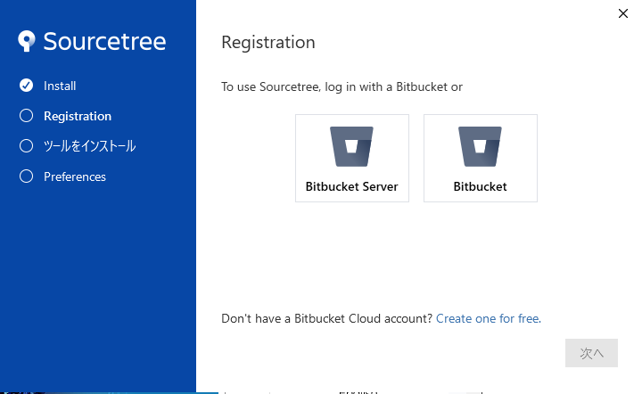
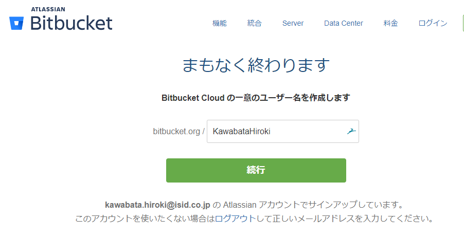
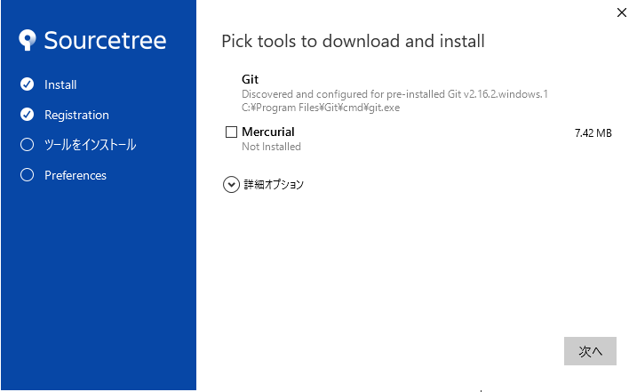
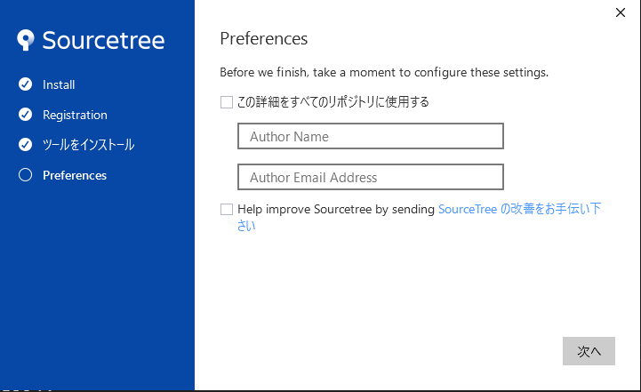
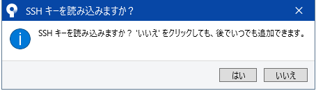
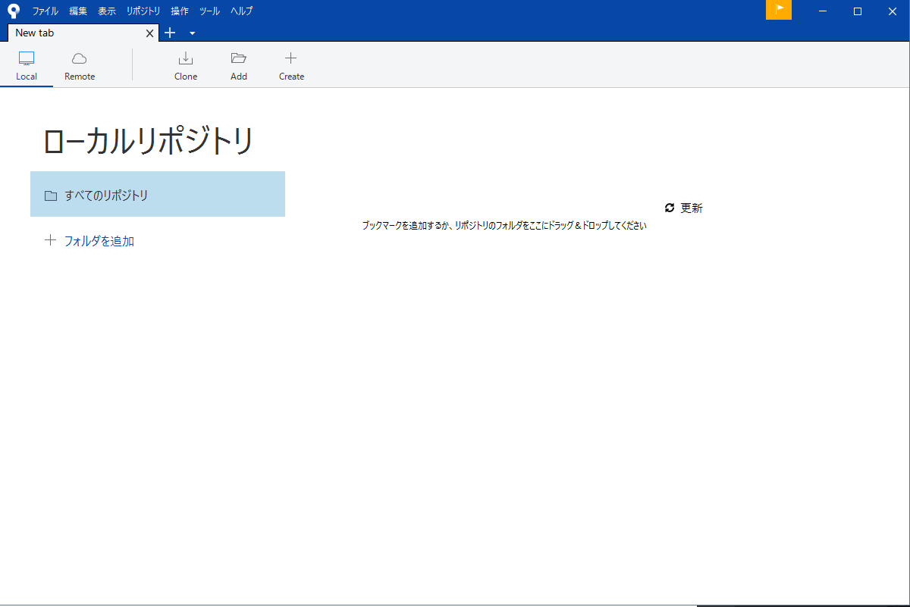
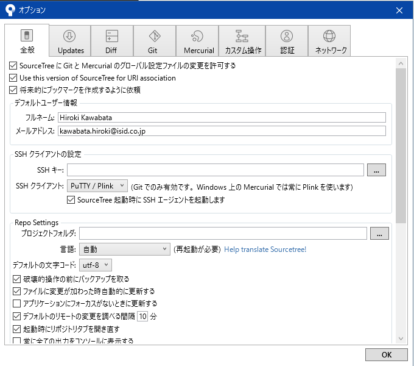
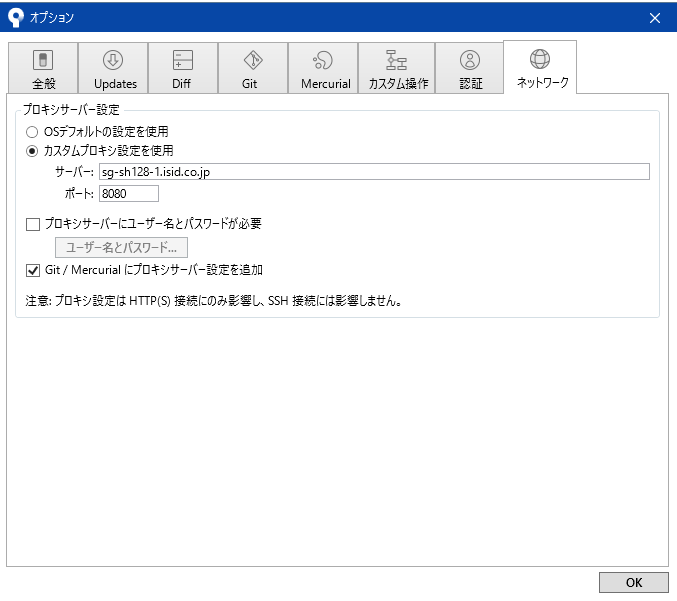
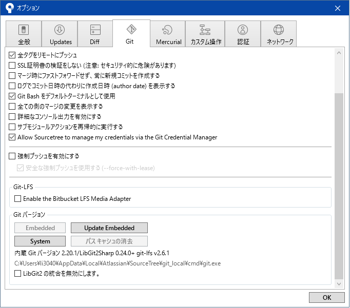

# SourceTreeのインストール

## Atlassian accountの作成

ブラウザで[https://id.atlassian.com/signup](https://id.atlassian.com/signup)ヘアクセスします。

「メールアドレス」「氏名」「パスワード」を入力し、「Sign Up」を選択します。メールアドレスは会社のアドレスを使用して下さい。

会社のメールアドレス宛にAtlassianから確認メールが届いていることを確認して下さい。

## SourceTreeのインストール

SourceTreeをインストールします(以下では2019/03/01時点での最新バージョンであるSourceTree3.0.17を使用しています)。

インストーラーを起動します。

ウィザードに従ってインストールを進めます。右のBitbucket(Bitbucket Cloud)を選択します。

Bitbucketを選択すると、別ウィンドウが開きます。お好きなユーザ名を入力して「続行」してください。インストーラに戻ると、次に進みます。

Gitが「Not Install」となっている場合は、チェックを入れて「次へ」を押します。

特に何もチェック、入力しない状態で次に行ってもらって構いません。

「SSHキーを読み込みますか？」というダイアログが出るので、「No」を選択します。

SourceTreeが起動します。

続いてユーザーの名前とメールアドレスを設定します。

「ツール」の「オプション」を選択します。「全般」タブの「デフォルトユーザー情報」に、各自の名前とメールアドレスを入力し、OKを押します。

「ネットワーク」タブを開き、下図の通りプロキシ設定を入力し、OKを押します。

「Git」タブを開き、下図の通りGitが有効になっていることを確認して下さい。
（Gitバージョンやチェックボックスの内容は実際と異なる場合があります）

「Gitサポートは現在無効です」と表示される場合は、「Gitサポートを有効化」を押下し、
「システム全体でなく、SourceTree単独で使うためだけの内臓のGitを～」を選択してください。

以上でSourceTreeのインストールは完了です。
